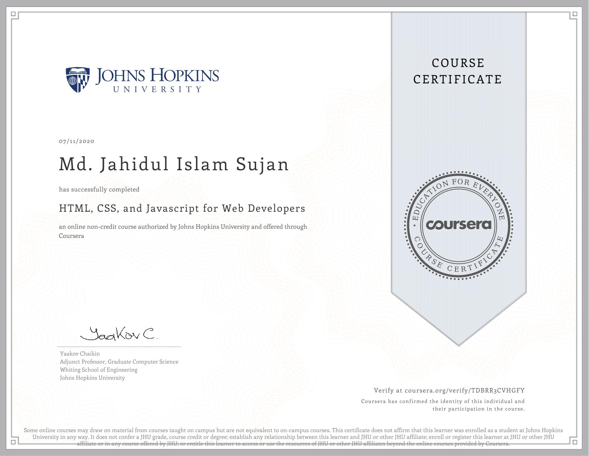
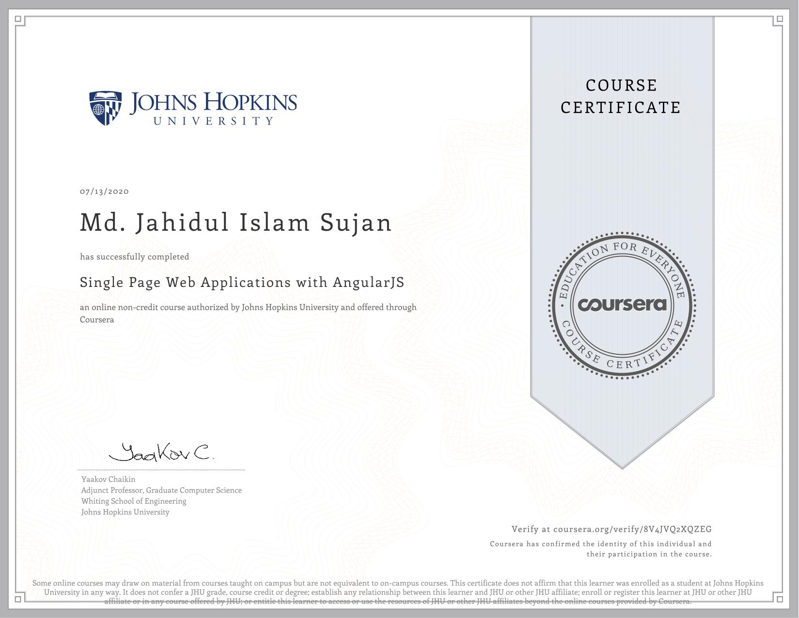
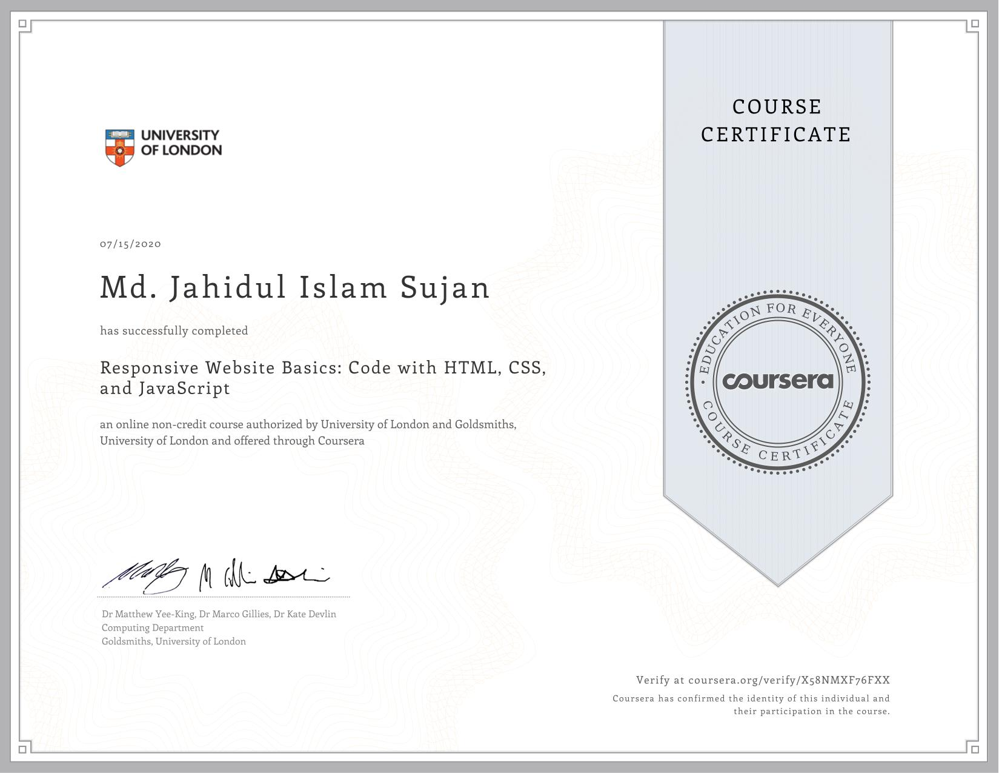
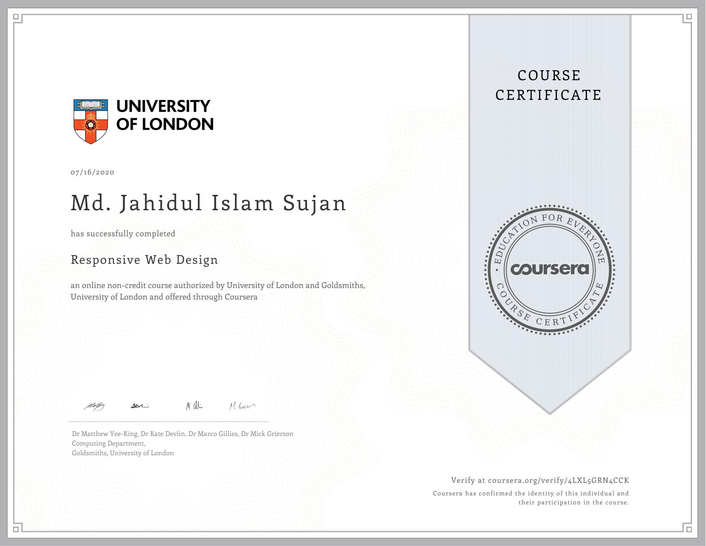
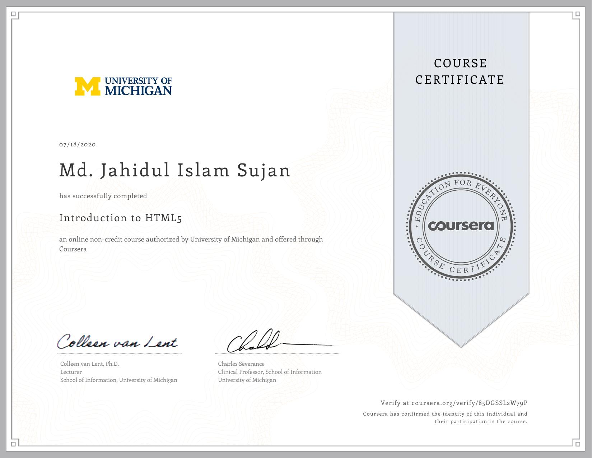
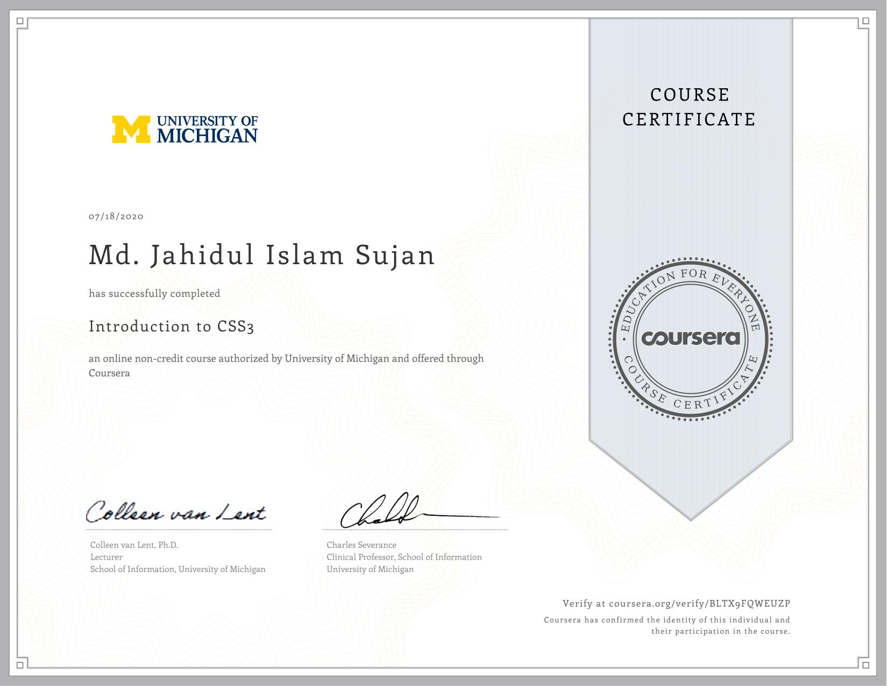
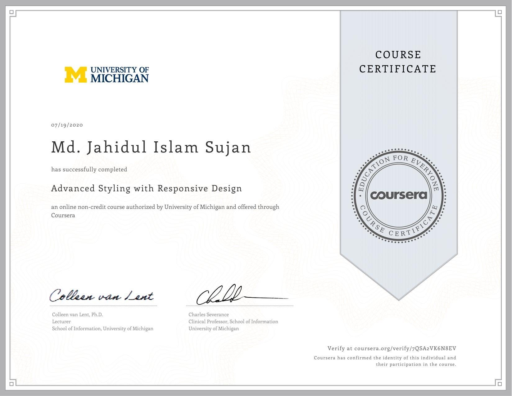
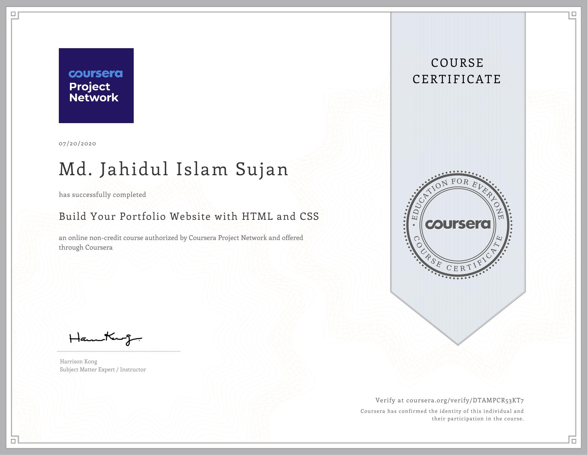
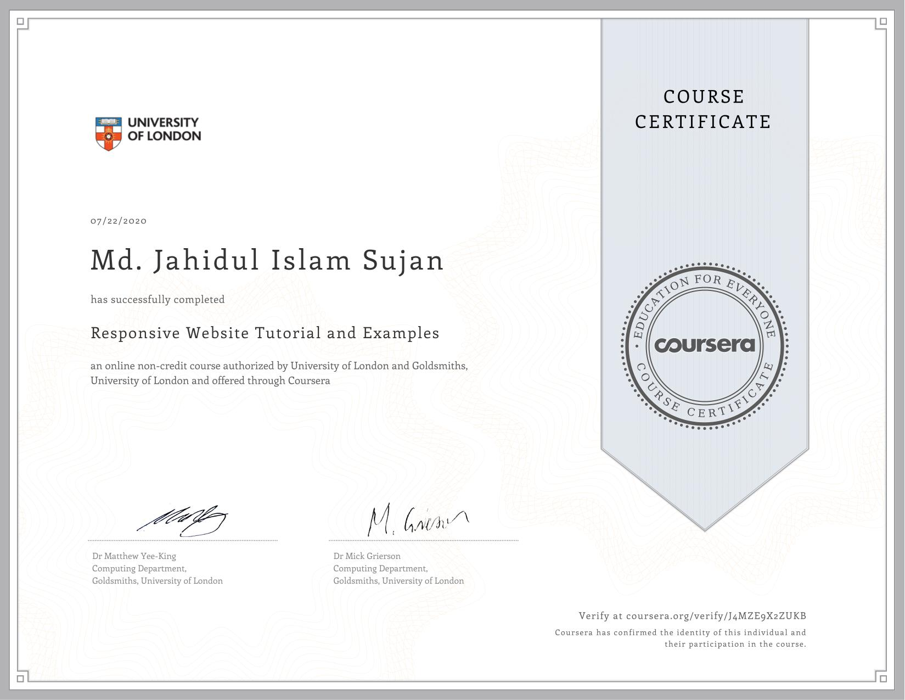
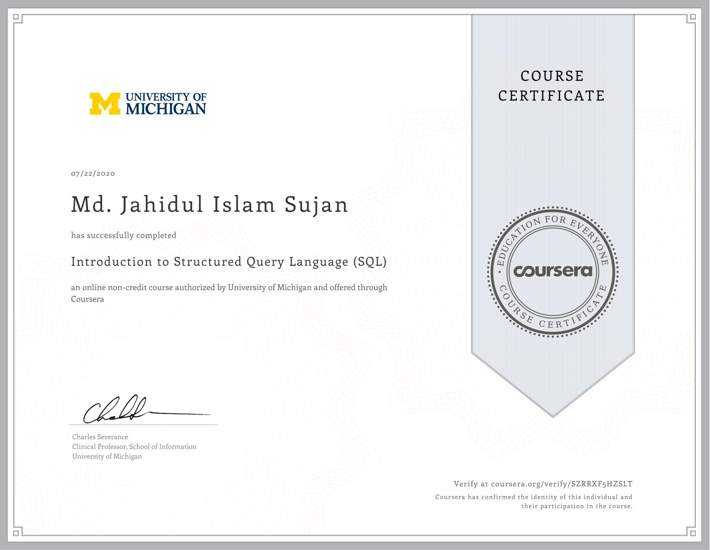

# [MD. JAHIDUL ISLAM SUJAN](https://jahidofficial.github.io)

# Coursera

### HTML, CSS, and Javascript for Web Developers

### Single Page Web Applications with AngularJS

### Responsive Website Basics: Code with HTML, CSS, and JavaScript

### Responsive Web Design

### SQL for Data Science

### Introduction to HTML5

### Introduction to CSS3

### Interactivity with JavaScript

### Advanced Styling with Responsive Design

### Build Your Portfolio Website with HTML and CSS

### Responsive Website Tutorial and Examples

### Introduction to Structured Query Language (SQL)

<!--### Building Database Applications in PHP-->
<!--### Building Web Applications in PHP-->
<!--### Front-End Web UI Frameworks and Tools: Bootstrap 4-->
<!--### JavaScript, jQuery, and JSON-->
<!--### Web Design for Everybody Capstone-->

##### &copy; Copyright 2020, All right reserved.